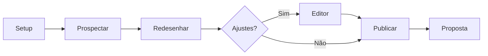

# Prospector de Sites — Cursor Skills

> Plugin original do Claude ([ArrecheNeto/PROSPECTOR-DE-SITES](https://github.com/ArrecheNeto/PROSPECTOR-DE-SITES)), adaptado para o Cursor. Ciclo completo de prospecção e venda de sites para profissionais liberais com boa reputação no Google, mas site fraco.

**Ciclo:** Achou → Refez → Publicou → Ofertou

---

## Instalação

Copie as pastas deste diretório para `~/.cursor/skills/`:

```bash
cp -r cursor-skills/* ~/.cursor/skills/
```

Reinicie o Cursor ou abra um novo chat para o agente detectar as skills.

| Item | Detalhe |
|------|---------|
| **Instalação local** | `~/.cursor/skills/` |
| **Pasta de trabalho** | `prospector-data/` no workspace ativo |

---

## Skills incluídas

| Skill | Função |
|-------|--------|
| `prospector-de-sites` | Hub principal — orquestra os 6 workflows |
| `prospeccao-maps` | Busca e qualificação no Google Maps |
| `redesign-premium` | Redesign premium + editor visual + comparador |
| `deploy-hostinger` | Publicação FTP/cPanel na Hostinger |
| `proposta-email` | E-mail de proposta comercial (sem preço) |

---

## Fluxo de trabalho



### 1. Setup (uma vez)

Configura assinatura, nichos padrão, cidade e credenciais da Hostinger.

**Prompt:**
```
Rode o setup do prospector de sites
```

**Gera:** `prospector-config.json`

> ⚠️ A senha FTP **nunca** vai no chat — preencher manualmente no JSON.

---

### 2. Prospectar

Busca no Google Maps negócios com nota ≥ 4.7, ≥ 40 avaliações, site ruim e e-mail público.

**Prompt:**
```
Prospectar nutricionistas em Campinas
```

**Gera:** `leads.md` + `leads.csv`

**Critérios eliminatórios:**
- Sem site próprio (só Instagram, Doctoralia, etc.) → descarta
- Site já bom → descarta
- Sem e-mail público → descarta

---

### 3. Redesenhar

Recria as páginas dos melhores leads (mínimo 5 por lote) com estética premium, mantendo conteúdo, logo e fotos reais.

**Prompt:**
```
Redesenhar os 5 melhores leads
```

**Gera por cliente:**
- `sites/[slug]/[slug].html` — página final
- `sites/[slug]/[slug]-editor.html` — versão editável
- `comparar.html` — antes/depois lado a lado

---

### 4. Editor (opcional)

Edita textos e imagens direto no navegador.

**Prompt:**
```
Abrir editor do cliente jessica-nutri
```

**Como usar o editor:**
1. Abrir `[slug]-editor.html` no navegador
2. Clicar em textos para editar
3. Clicar em imagens para trocar (base64 embutido)
4. Botão "Exportar página" → substituir o HTML original

---

### 5. Publicar

Sobe as páginas na Hostinger via FTP ou cPanel.

**Prompt:**
```
Publicar todos os sites na Hostinger
```

**URL pública:** `https://[dominio]/clientes/[slug]/`

---

### 6. Proposta

Escreve e-mail de rapport (sem preço) e cria rascunho no Gmail.

**Prompt:**
```
Enviar proposta para todos os publicados
```

**Regras do e-mail:**
- 120–180 palavras
- Elogio específico (nota Google, avaliações)
- Defeito delicado do site atual
- Link da nova versão já no ar
- CTA leve: "me diga o que achou"
- **Sem preço** no primeiro contato

---

## Estrutura de arquivos

```
prospector-data/
├── prospector-config.json    # Config + credenciais Hostinger
├── leads.md                  # Pipeline de leads (status)
├── leads.csv                 # Export para Google Sheets
├── comparar.html             # Comparador antes/depois
└── sites/
    └── [slug]/
        ├── [slug].html
        ├── [slug]-editor.html
        └── preview.png       # Screenshot para anexar no e-mail
```

### Status dos leads

```
novo → redesenhado → publicado → proposta enviada
```

---

## Requisitos

- [ ] MCP **cursor-ide-browser** habilitado no Cursor
- [ ] Hospedagem **Hostinger** com cPanel
- [ ] Conta **Gmail** para rascunhos
- [ ] Workspace aberto com pasta `prospector-data/`

---

## Mapeamento Claude → Cursor

| Claude | Cursor |
|--------|--------|
| `/prospectar`, `/setup`, etc. | Prompts em linguagem natural |
| Claude in Chrome | MCP `cursor-ide-browser` |
| Google Sheets automático | `leads.csv` (importar manualmente) |
| Conector Gmail | Gmail via browser |
| Pasta conectada Cowork | `prospector-data/` no workspace |

---

## Nichos que funcionam bem

- Nutricionistas
- Psicólogos
- Advogados
- Psiquiatras
- Dentistas
- Fisioterapeutas

> Alto ticket por cliente + site como vitrine de confiança.

---

## Segurança

A senha FTP nunca é digitada no chat: preencha o campo `"senha"` em `prospector-config.json` localmente.

---

Lucas Paixão
