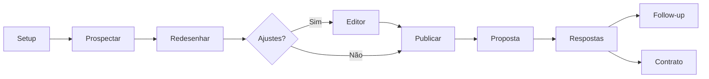

# Prospector de Sites — Cursor Skills v0.15.0

> Ciclo completo de prospecção e venda de sites para profissionais liberais com boa reputação no Google, mas site fraco (ou nenhum site).

**Ciclo:** Achou → Refez (ou criou do zero) → Publicou → Ofertou (+ respostas, follow-up, contrato)

---

## Instalação

```bash
git clone git@github.com:lucasgpaixao/PROSPECTOR-DE-SITES.git
cp -r cursor-skills/* ~/.cursor/skills/
```

Reinicie o Cursor ou abra um novo chat.

| Item | Detalhe |
|------|---------|
| **Repositório** | [lucasgpaixao/PROSPECTOR-DE-SITES](https://github.com/lucasgpaixao/PROSPECTOR-DE-SITES) (privado) |
| **Pasta de trabalho** | `prospector-data/` no workspace |

---

## Skills incluídas

| Skill | Função |
|-------|--------|
| `prospector-de-sites` | Hub — orquestra os 10 workflows |
| `prospeccao-maps` | Busca e qualificação no Google Maps (site fraco ou sem site) |
| `redesign-premium` | Redesign de site existente + editor + comparador |
| `criacao-premium` | Site do zero (leads sem site) + editor + comparador |
| `deploy-hostinger` | Publicação FTP/hPanel/publicador automático |
| `proposta-email` | E-mail e WhatsApp anti-spam com página-capa |
| `dashboard-leads` | CRM local (kanban, financeiro, contratos) |
| `contrato-servico` | Contrato HTML + DOCX travado |

---

## Fluxo de trabalho



### Prompts por etapa

| Etapa | Prompt |
|-------|--------|
| Setup | `Rode o setup do prospector de sites` |
| Prospectar | `Prospectar nutricionistas em Campinas` |
| Redesenhar | `Redesenhar os 5 melhores leads` |
| Criar site | `Criar o site dos leads sem site` |
| Editor | `Abrir editor do cliente jessica-nutri` |
| Publicar | `Publicar todos na Hostinger` |
| Proposta | `Enviar proposta para os publicados` |
| Respostas | `Verificar respostas das propostas` |
| Follow-up | `Gerar follow-up dos sem resposta` |
| Contrato | `Gerar contrato do cliente fechado` |

---

### Novidades v0.15.0

- **Site do zero** (`criar-site` + skill `criacao-premium`) — leads sem site próprio agora viram cliente também, usando fotos e avaliações reais do perfil do Google Maps
- **Proposta por WhatsApp** — além do e-mail, mensagem pronta no WhatsApp Web (você revisa e clica em enviar)
- **Dashboard CRM** (`prospector.db` + kanban + financeiro + contratos), agora com coluna `tipo` (redesign/criação) e `whatsappProposta`

### Novidades v0.13.5

- **Dashboard CRM** (`prospector.db` + kanban + financeiro + contratos)
- **Página-capa** (`proposta.html`) — único link do e-mail
- **Publicador automático** Windows (fila FTP a cada 1 min)
- **Checklist anti-spam** rigorosa na proposta
- **`/respostas`** — monitora Gmail
- **`/followup`** — 1 follow-up por lead após 3 dias
- **`/contrato`** — HTML + DOCX travado
- **HTTPS obrigatório** antes de enviar proposta

---

## Estrutura de arquivos

```
prospector-data/
├── prospector-config.json
├── prospector.db
├── dashboard.html + dashboard-server.py
├── iniciar-dashboard.bat
├── manual.html
├── comparar.html
├── fila-publicacao.txt
└── sites/[slug]/
    ├── [slug].html
    ├── [slug]-editor.html
    ├── proposta.html
    └── contrato-[slug].docx
```

### Status dos leads

```
novo → redesenhado → publicado → proposta → respondeu → fechado
```

---

## Requisitos

- [ ] MCP **cursor-ide-browser** (Maps, deploy e WhatsApp Web)
- [ ] **Hostinger** com hPanel/FTP
- [ ] **Gmail** para rascunhos
- [ ] **Python** (dashboard + contrato)
- [ ] **Windows** (publicador `.bat`/`.ps1`)

---

## Segurança

Senha FTP só em `prospector-config.json` — preencher no dashboard (Configurações) ou no arquivo local.

---

Lucas Paixão
